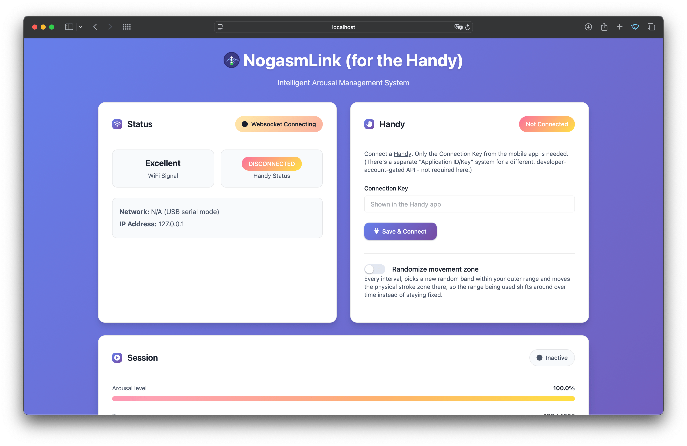

# NogasmLink (for the Handy)

An intelligent arousal management system for ESP32 that reads a pressure sensor to automatically manage an edging
session, driving [The Handy](https://www.handyfeeling.com) as the output device. Interfaces over **USB serial** to a
small companion app that runs on your computer - no WiFi setup on the device required.

Based on [sgrljess/nogasm-link](https://github.com/sgrljess/nogasm-link), adapted to drive The Handy specifically:
replaced the ESP32-hosted WiFi dashboard with a USB-serial companion app, added Handy REST API support (with a
movement-zone randomizer), and switched vibration control to full-resolution speed instead of Lovense's coarser
20-level scale. The original BLE/Lovense and WiFi-hosted-dashboard code paths are still present and can be re-enabled
(see `ENABLE_BLE`/`ENABLE_WIFI_WEB_SERVER` in `src/main.cpp`), but are off by default and hidden from the UI.

## What you need

- An ESP32 board (developed against an M5Stack Atom Lite)
- A pressure sensor - an HX710B-based ADC breakout (e.g. an MPX5700GP-based pressure sensor module)
- An inflatable plug (just poke a small hole in it and push the sensor tube in)
- A USB cable to your computer (used for both flashing and, afterwards, the live serial link)
- [The Handy](https://www.handyfeeling.com), connected to WiFi with its own Connection Key
- A computer to run the companion app + web dashboard on

## Features

- **Pressure Sensor Integration**: Real-time monitoring with configurable sensitivity
- **Intelligent Edging**: Automated arousal detection with cooldown periods
- **Clench Detection**: Advanced pressure pattern recognition
- **The Handy Control**: Full-resolution (0-255) speed control, with independent min/max speed limits and
  configurable ramp time
- **Movement Zone Randomization**: Periodically shifts Handy's physical stroke range within a configured band,
  instead of always using the same fixed range
- **Web Dashboard**: Real-time data visualization and session control, served locally by the companion app
- **USB Serial Link**: No WiFi credentials, captive portal, or router quirks to fight with

## UI

### Session



### Hardware


## Credits

- https://github.com/sgrljess/nogasm-link - the project this is based on
- https://github.com/nogasm/nogasm
- https://github.com/MausTec/edge-o-matic-3000
- https://github.com/Edging-Machines/Edging-Machines
- https://docs.buttplug.io/docs/stpihkal/protocols/lovense/

### Components

- ESP32 development board (M5Stack Atom Lite)
- HX710B-based pressure sensor (e.g. MPX5700GP)


### Pin Configuration

```
Pressure Sensor SCK: GPIO 32
Pressure Sensor OUT: GPIO 26
```

See `HX710_SCK_PIN`/`HX710_OUT_PIN`/`NEOPIXEL_PIN` in `src/main.cpp` - these match the M5Stack Atom Lite's built-in
Grove port and onboard LED.

## Architecture

**ESP32 firmware** does the real-time work: reads the pressure sensor, runs the arousal/edging algorithm
(`ArousalManager`), and talks to a companion app over USB serial (`SerialLink`/`SerialDeviceOutput`) - it tells the
app "set speed to X", it doesn't call Handy's API itself.

**`laptop-app/`** (Node.js) runs on your computer: hosts the web dashboard locally, makes the actual Handy REST API
calls (it has real internet access), and runs the movement zone randomizer. See
[laptop-app/README.md](laptop-app/README.md) for the serial protocol reference and setup details.

**Data flow**: Pressure sensor → `ArousalManager` (state machine) → USB serial → `laptop-app` → Handy REST API,
mirrored to the web dashboard over WebSocket + REST the whole way.

## Installation

### 1. Build the web dashboard

```bash
cd webapp
yarn install
yarn build
```

This produces `data/`, which both the companion app and (if you re-enable WiFi mode) the ESP32's filesystem image
use.

### 2. Flash the firmware

Use Platform.io from whever you like to flash eg.

```bash
pio run --target upload
```

### 3. Run the companion app

```bash
cd laptop-app
npm install
npm start
```

Close any other program holding the ESP32's serial port first (a `pio device monitor` session, Arduino IDE, etc.) -
only one process can hold it at a time. See [laptop-app/README.md](laptop-app/README.md) for port auto-detection
details and troubleshooting.

### 4. Open the dashboard

**http://localhost:3000** (or whatever `PORT` you set). Enter your Handy's Connection Key under the Handy panel and
hit Save & Connect.

## Usage

1. **Connect Handy**: enter its Connection Key in the dashboard's Handy panel
2. **Session Control**: start/stop the edging session from the dashboard
3. **Sensitivity**: adjust via the Arousal sensitivity slider
4. **Movement Zone**: optionally enable randomized stroke-range shifting
5. **Data Export**: download session data as CSV from the Analytics panel

## API Overview

Served locally by `laptop-app` (not the ESP32) at `http://localhost:3000` by default.

### WebSocket Updates

Real-time data at `/ws`:

- `ble_status`: includes Handy connection status (name kept for frontend compatibility with the original WiFi mode)
- `arousal_status`: pressure, arousal level, session state

## Configuration Options

- **Arousal Decay Rate**: How quickly arousal decreases (0.1-0.99)
- **Sensitivity Threshold**: Peak detection sensitivity
- **Ramp/Cooldown Times**: Speed control and rest periods
- **Min/Max Vibration Level**: Speed floor and ceiling, independent of ramp time
- **Clench Detection**: Pressure pattern recognition settings
- **Movement Zone**: Outer range, active band width, shift interval, and pause-before-shift (see `laptop-app/`)
